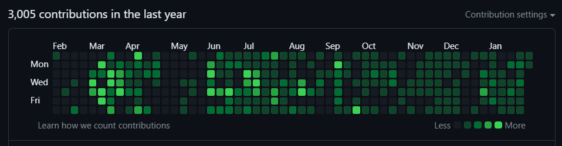
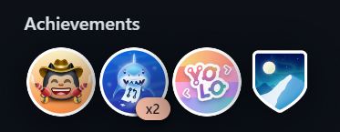

**Welcome to my GitHub!** 

- 👋 Hi, I’m Shaza Ali 
- 👀 I’m interested in Backend Engineering 
- 🌱 I’m currently enrolled in ALX software enginnering apprenticeship.
- 💞️ MERN Stack Instructor @GoMyCode Egypt
- I used to build Responsive functional web apps using:
    HTML- CSS - JavaScript - JQuery- Bootstrap -JavaScript - React Js - Node Js - Python - Flask.

- 📫 How to reach me: [shaza.aly@gmail.com]  ----    [https://www.linkedin.com/in/shazaali/]
- 📚 (See My Technical Blog)[https://shazaali.substack.com/]

### Skills and Interests

- Proficient in:
  - Programming languages: C, Python, JavaScript
  - Version control with Git and GitHub
  - Web development with HTML, CSS, and JavaScript, Python Flask, Node Js
  - Linux and system engineering
  - Databases including SQL MySQL, NoSQL.
  - DevOps tools like Nginx and monitoring
- Interested in:
  - Front-end and back-end development
  - Building scalable and efficient web applications
  - Collaborating on open-source projects
  - Learning new technologies and frameworks

Below are links to some of my repositories where you can find my ALX projects alongside other personal projects. Dive into my journey as a software engineer, exploring everything from low-level programming to full-stack development.

### ALX Projects
Embark on a tour through my educational journey with ALX, showcasing skills in C, Python, DevOps, and more:
- [alx-low_level_programming](https://github.com/shazaaly/alx-higher_level_programming) - Explore the basics of C programming, focusing on algorithms, data structures, and memory management.
- [alx-higher_level_programming](https://github.com/shazaaly/alx-higher_level_programming) - Dive into Python programming covering OOP, scripting, and web scraping.
- [alx-system_engineering-devops](https://github.com/shazaaly/alx-system_engineering-devops) - Insights into the world of DevOps, including scripting in Bash and managing web servers.
- [AirBnB_clone](https://github.com/shazaaly/AirBnB_clone) - The first step in building a complete web application resembling AirBnB.
- [AirBnB_clone_v2](https://github.com/shazaaly/AirBnB_clone_v2) - Enhancements to the original clone, integrating SQL databases.
- [AirBnB_clone_v4](https://github.com/shazaaly/AirBnB_clone_v4) - Advanced features including RESTful API integration and dynamic web interfaces.
- [alx-backend](https://github.com/shazaaly/alx-backend) - Backend development principles, focusing on microservices and REST APIs.
- [alx-backend-python](https://github.com/shazaaly/alx-backend-python) Python backend development, emphasizing on Flask framework.
- [alx-backend-storage](https://github.com/shazaaly/alx-backend-storage) - Data persistence and manipulation using SQL and NoSQL databases.
- [alx-backend-javascript](https://github.com/shazaaly/alx-backend-javascript) - Utilizing JavaScript in backend development to create scalable applications.
- [alx-interview](https://github.com/shazaaly/alx-interview) - Preparation exercises for software engineering interviews, focusing on algorithms and problem-solving.

### Other Personal Projects
Showcasing a variety of projects where I've applied and expanded my skills:
- [Advanced-Caching-CLI-Python](https://github.com/shazaly/Advanced-Caching-CLI-Python) - A CLI tool for advanced caching techniques in Python.
- [mediconsult](https://github.com/shazaaly/mediconsult) - A healthcare consultation platform to connect patients with doctors.
- [Uber Clone React Js](https://github.com/shazaaly/uberDemo2) - A React implementation of an Uber clone (Note: This link is repeated, consider updating or removing the duplicate).
- [Ecommerce React Js](https://github.com/shazaaly/ecommercereact) - An e-commerce platform built with React.js showcasing modern web development practices.
- [Restaurant React Js](https://github.com/shazaaly/restaurant) - A restaurant website project emphasizing React.js for dynamic user interfaces.

### Portfolio & Contact
- **[Portfolio Web Site](https://portfoliogoreact.vercel.app/)** - Discover more about my projects and professional journey.
- **[LinkedIn](https://www.linkedin.com/in/shazaly)** - Connect with me professionally.
- **[Twitter](https://twitter.com/shazaAlyOthman)** - Follow my tech and coding adventures.
- **[My Tech Blog](https://shazaali.substack.com/)** - Insights and tutorials on the latest in software engineering.

Thank you for visiting my GitHub profile!

---
